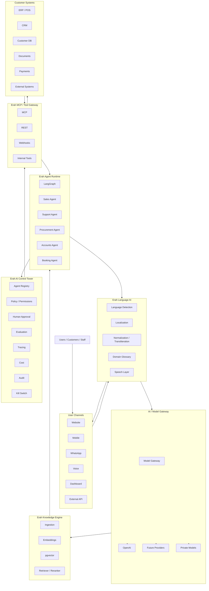

# Erah AI

## A 10-Phase Production AI Engineering Ecosystem

**Erah AI** is a long-term, production-oriented AI engineering project built to evolve from foundational machine learning concepts into a secure, multilingual, observable, governed, multi-agent business AI platform.

This repository is intentionally designed as **one evolving platform**, not ten disconnected demo projects.

The journey starts with the mechanics beneath AI systems and progressively builds:

**AI Foundations → Production LLM Applications → Multilingual & Voice AI → RAG → LangGraph Agents → MCP → LLMOps & Evaluation → AI Security → Multi-Agent Control Tower → Production AI Platform**

---

# Table of Contents

1. [Executive Summary](#1-executive-summary)
2. [What Erah AI Is](#2-what-erah-ai-is)
3. [Business Value](#3-business-value)
4. [Customer Data Model](#4-customer-data-model)
5. [Core Architecture Principles](#5-core-architecture-principles)
6. [Technical Core](#6-technical-core)
7. [Complete Technology Landscape](#7-complete-technology-landscape)
8. [10-Phase Roadmap](#8-10-phase-roadmap)
9. [Phase 01 — AI Foundations & Model Mechanics](#9-phase-01--ai-foundations--model-mechanics)
10. [Phase 02 — Production LLM Application Engineering](#10-phase-02--production-llm-application-engineering)
11. [Phase 03 — Multilingual & Voice AI](#11-phase-03--multilingual--voice-ai)
12. [Phase 04 — RAG & Knowledge Engineering](#12-phase-04--rag--knowledge-engineering)
13. [Phase 05 — LangGraph Agent Engineering](#13-phase-05--langgraph-agent-engineering)
14. [Phase 06 — MCP & Tool Engineering](#14-phase-06--mcp--tool-engineering)
15. [Phase 07 — LLMOps, Evaluation & Observability](#15-phase-07--llmops-evaluation--observability)
16. [Phase 08 — AI Security, Guardrails & Red Teaming](#16-phase-08--ai-security-guardrails--red-teaming)
17. [Phase 09 — Multi-Agent Systems & AI Control Tower](#17-phase-09--multi-agent-systems--ai-control-tower)
18. [Phase 10 — Production AI Platform & Enterprise Scale](#18-phase-10--production-ai-platform--enterprise-scale)
19. [End-State System Architecture](#19-end-state-system-architecture)
20. [Repository Structure](#20-repository-structure)
21. [Data Architecture](#21-data-architecture)
22. [AI Engineering Lifecycle](#22-ai-engineering-lifecycle)
23. [Testing Strategy](#23-testing-strategy)
24. [Evaluation Strategy](#24-evaluation-strategy)
25. [Security Model](#25-security-model)
26. [Observability Model](#26-observability-model)
27. [Cost & AI FinOps](#27-cost--ai-finops)
28. [Deployment Strategy](#28-deployment-strategy)
29. [Customer Onboarding](#29-customer-onboarding)
30. [Potential Business Models](#30-potential-business-models)
31. [Engineering Standards](#31-engineering-standards)
32. [Definition of Complete](#32-definition-of-complete)
33. [Reference Technologies](#33-reference-technologies)

---

# 1. Executive Summary

Erah AI is designed around a simple business idea:

> **Connect governed AI agents to real business data and tools so the agents can understand, reason, retrieve, act, and respond safely in the user's preferred language.**

A customer is not buying only a chatbot and is not buying only access to an LLM.

A customer is buying an **AI workforce connected to the customer's own software, knowledge, permissions, workflows, and policies**.

A future Erah AI deployment may look like:

```text
Customer
   │
   ├── Website
   ├── Mobile App
   ├── WhatsApp
   ├── Voice
   └── Internal Dashboard
            │
            ▼
       Erah Language AI
            │
            ▼
       Model Gateway
            │
            ▼
       Knowledge / RAG
            │
            ▼
       LangGraph Runtime
            │
       ┌────┼───────────────┐
       ▼    ▼               ▼
    Sales  Support     Procurement
    Agent  Agent          Agent
       │    │               │
       └────┼───────────────┘
            ▼
       Erah Control Tower
            │
     Permissions / Policies
     Evaluations / Tracing
     Human Approval / Audit
            │
            ▼
        MCP / Tools
            │
   ┌────────┼───────────────┐
   ▼        ▼               ▼
  ERP      CRM          Customer DB
  POS    Payments       Documents
```

The end-state platform should support:

- multilingual text conversations;
- multilingual voice conversations;
- static application localization;
- RAG over customer-owned knowledge;
- structured outputs;
- tool calling;
- MCP clients and servers;
- single-agent workflows;
- multi-agent workflows;
- human-in-the-loop approvals;
- evaluation datasets;
- prompt and agent versioning;
- tracing;
- cost tracking;
- red teaming;
- tenant isolation;
- agent permissions;
- policy enforcement;
- audit logs;
- model routing;
- private/open-source model serving when required;
- production deployment and scaling.

---

# 2. What Erah AI Is

Erah AI has three identities at the same time.

## 2.1 An AI Engineering Learning System

The project deliberately starts from fundamentals.

We should understand enough about:

- data;
- machine learning;
- deep learning;
- tensors;
- Transformers;
- tokenization;
- embeddings;
- inference;
- vector retrieval;
- LLM behavior;
- model serving;

before hiding everything behind agent abstractions.

---

## 2.2 A Production Engineering Platform

The codebase eventually becomes a platform composed of reusable services:

- AI Gateway;
- Language Gateway;
- Knowledge Engine;
- Agent Runtime;
- MCP Gateway;
- Evaluation Platform;
- Security Gateway;
- Control Tower.

Each phase contributes code that survives into later phases.

---

## 2.3 A Potential B2B Product

The commercial version of Erah AI can help organizations deploy customer-specific AI workers.

Possible agents:

- Customer Support Agent;
- Sales Agent;
- Procurement Agent;
- Accounts Agent;
- HR Agent;
- Booking Agent;
- Inventory Agent;
- Business Analyst Agent;
- School Admission Agent;
- Attendance Agent;
- Restaurant Order Agent;
- Hotel Reservation Agent.

The customer's data remains customer-specific.

Erah AI supplies the intelligence, orchestration, governance, evaluation, connectors, and control plane.

---

# 3. Business Value

## 3.1 From Software Assistance to AI Execution

Traditional business software works like this:

```text
Human
  ↓
Open Software
  ↓
Find Information
  ↓
Interpret Dashboard
  ↓
Make Decision
  ↓
Perform Action
```

Erah AI aims to move selected workflows toward:

```text
Business Event / User Request
           ↓
        AI Agent
           ↓
   Retrieve Information
           ↓
      Reason / Decide
           ↓
       Policy Check
           ↓
      Human Approval
      when necessary
           ↓
       Execute Tool
           ↓
      Record Outcome
```

Humans remain responsible for high-risk decisions, business rules, oversight, and exceptions.

---

## 3.2 Build AI Once, Reuse It

A central AI platform prevents every business application from independently rebuilding:

- authentication;
- language support;
- model access;
- RAG;
- agent orchestration;
- tracing;
- evaluation;
- tool authorization;
- cost tracking;
- voice;
- audit;
- red teaming.

Instead:

```text
                      ERAH AI
                         │
      ┌──────────────────┼──────────────────┐
      ▼                  ▼                  ▼
 Business App A     Business App B     Business App C
      │                  │                  │
   Retail             Schools             Hotels
```

---

## 3.3 Customer-Specific AI Workforce

For one customer:

```text
ABC Pharmacy
    │
    ├── Support Agent
    ├── Inventory Agent
    ├── Procurement Agent
    └── Sales Agent
```

For another:

```text
XYZ School
    │
    ├── Admission Agent
    ├── Attendance Agent
    ├── Parent Support Agent
    └── School Analytics Agent
```

Both can use the same Erah AI platform while remaining logically and operationally isolated.

---

## 3.4 Control Tower as Independent Value

A major commercial component is the **AI Control Tower**.

Organizations need answers to questions such as:

- Which agents are active?
- What tools can they access?
- What did an agent do?
- What data did it retrieve?
- Which model and prompt version ran?
- Did the agent follow policy?
- How much did the run cost?
- Was human approval required?
- Was the response grounded?
- Did a security test fail?
- Can the run be replayed?
- Can the agent be paused instantly?

This makes governance a first-class product rather than an afterthought.

---

# 4. Customer Data Model

Customer data handling is one of the most important architectural decisions in Erah AI.

## 4.1 Erah AI Does Not Need to Copy Every Customer Database

For fast-changing operational data, prefer live tools.

Examples:

- inventory;
- orders;
- customer records;
- invoices;
- bookings;
- attendance;
- payments;
- supplier status.

Flow:

```text
Agent
  ↓
Approved Tool / MCP
  ↓
Customer API
  ↓
Customer System
  ↓
Only Required Result
  ↓
Agent
```

---

## 4.2 Documents Use Customer-Specific RAG

For relatively static or knowledge-oriented information:

- SOPs;
- policies;
- manuals;
- FAQs;
- contracts;
- product documentation;
- internal procedures;
- training materials;

use a tenant-scoped knowledge pipeline.

```text
Customer Document
      ↓
   Ingestion
      ↓
   Parsing
      ↓
   Cleaning
      ↓
   Chunking
      ↓
   Metadata
      ↓
   Embedding
      ↓
Tenant-Scoped Vector Index
```

---

## 4.3 Multi-Tenant Isolation

Every relevant resource must be tenant-aware.

Example request context:

```json
{
  "tenant_id": "tenant_abc",
  "user_id": "user_123",
  "agent_id": "procurement_agent",
  "request_id": "req_456"
}
```

Every layer must preserve tenant context.

```text
Authentication
      ↓
Tenant Resolution
      ↓
Authorization
      ↓
Agent
      ↓
RAG / Tool / Database
      ↓
Tenant Filter Again
      ↓
Result
```

Never rely on a prompt instruction such as "only access Company A."

Isolation must exist in application logic, policy, databases, indexes, credentials, and tool authorization.

---

## 4.4 Read and Write Operations Must Be Different

Read operations:

```text
get_inventory()
get_customer()
get_invoice()
get_attendance()
```

can be lower risk.

Write operations:

```text
create_purchase_order()
issue_refund()
change_customer()
approve_payment()
delete_record()
```

require stronger controls.

A permission policy might be:

```text
get_inventory              ALLOW
get_supplier               ALLOW
create_purchase_order
    amount < 25,000         ALLOW
create_purchase_order
    amount >= 25,000        REQUIRE APPROVAL
make_payment               DENY
change_bank_account        DENY
```

---

# 5. Core Architecture Principles

Erah AI follows these principles across all ten phases.

## Principle 1 — Business Logic Is Language-Independent

Do not create separate application logic for English, Telugu, Hindi, Urdu, or Arabic.

```text
Any Language
     ↓
Intent / Structured Representation
     ↓
Business Capability
     ↓
Result
     ↓
Response in User Language
```

---

## Principle 2 — Tools, Not Hallucinated Actions

If the agent must know real inventory, it calls inventory.

If it must create a booking, it calls booking.

If it must know policy, it retrieves policy.

Never ask the model to invent operational state.

---

## Principle 3 — Least Privilege

Every agent receives only the tools and data required for its job.

---

## Principle 4 — Human Approval for High-Risk Actions

Autonomy is not binary.

Actions can be:

- automatically allowed;
- allowed within limits;
- approval-required;
- prohibited.

---

## Principle 5 — Every Important Run Is Observable

A production agent run should be traceable from user request to model calls to tool calls to final response.

---

## Principle 6 — Evaluation Before Deployment

A response that "looks good" is not sufficient evidence.

Use:

- golden datasets;
- regression tests;
- security tests;
- latency tests;
- cost tests;
- task-completion metrics.

---

## Principle 7 — Version Everything

Version:

- agents;
- prompts;
- models;
- tools;
- MCP servers;
- policies;
- knowledge bases;
- embeddings;
- evaluation sets.

---

## Principle 8 — Modular Monolith Before Premature Microservices

Erah AI starts with clear modules in a manageable codebase.

Services are separated when scale, isolation, ownership, or operational requirements justify it.

---

## Principle 9 — Model Provider Independence at the Architecture Level

The first production provider may be OpenAI, but business logic should not be permanently coupled to one provider.

---

## Principle 10 — Security Is Part of Agent Design

Prompt injection, tool misuse, leaked secrets, cross-tenant access, and excessive agency are architectural risks.

They cannot be solved only by adding one filter at the end.

---

# 6. Technical Core

The technical spine of Erah AI is:

```text
FastAPI
   │
OpenAI
   │
LangGraph
   │
MCP
   │
MLflow
   │
OpenTelemetry
   │
Promptfoo
```

Each exists for a different reason.

## FastAPI

Primary application/API layer.

Responsibilities eventually include:

- REST APIs;
- authentication;
- tenant context;
- streaming;
- WebSockets;
- request validation;
- tool endpoints;
- administration APIs;
- Control Tower APIs.

---

## OpenAI

Primary hosted AI platform initially.

Capabilities we plan to use include:

- LLM inference;
- Responses-style agent/application calls;
- structured output;
- tool/function calling;
- embeddings;
- speech;
- realtime voice where appropriate.

---

## LangGraph

Agent orchestration layer.

Responsibilities:

- graph state;
- nodes and transitions;
- checkpoints;
- durable agent flows;
- human-in-the-loop;
- agent memory patterns;
- subgraphs;
- multi-agent coordination.

---

## MCP

Standard tool/context integration layer.

Erah AI will build:

- MCP clients;
- MCP servers;
- MCP gateway;
- business-specific MCP tools;
- authorization controls around MCP.

The project should target the modern MCP architecture rather than copying outdated examples.

---

## MLflow

LLMOps / evaluation / experiment layer.

Use cases:

- experiments;
- traces;
- prompt records;
- evaluation datasets;
- scorers;
- model/agent comparisons;
- production quality analysis.

---

## OpenTelemetry

Vendor-neutral observability foundation.

Use:

- traces;
- metrics;
- logs;
- propagation across services;
- model/tool execution spans.

---

## Promptfoo

AI red teaming and adversarial regression testing.

Use in development and CI/CD for:

- prompt injection tests;
- jailbreak tests;
- tool abuse tests;
- MCP attack scenarios;
- leakage tests;
- policy bypass tests.

---

# 7. Complete Technology Landscape

The architecture intentionally includes more tools than we deploy on day one.

## Frontend

- Next.js
- React
- TypeScript
- Tailwind CSS
- shadcn/ui
- next-intl or i18next
- WebRTC for realtime browser audio when required

## Backend

- Python
- FastAPI
- Pydantic
- SQLAlchemy
- Alembic
- REST
- SSE
- WebSockets

## AI / LLM

- OpenAI
- structured outputs
- tool calling
- embeddings
- realtime/speech capabilities

## Model Gateway

- LiteLLM
- routing
- fallback
- provider abstraction
- rate limits
- budget controls

## Agents

- LangGraph
- state
- checkpoints
- memory
- interrupts
- human-in-the-loop
- subgraphs
- multi-agent workflows

## Tool Ecosystem

- MCP
- REST APIs
- webhooks
- internal Python functions
- customer-specific connectors

## Multilingual

- OpenAI multilingual capabilities
- BHASHINI evaluation for Indian-language requirements
- domain glossaries
- transliteration
- language preferences
- static locale files

## Voice

- speech-to-text
- text-to-speech
- OpenAI Realtime where appropriate
- WebRTC
- Twilio or Exotel for telephony integration

## RAG

- embeddings
- PostgreSQL
- pgvector
- object storage
- chunking
- metadata filtering
- reranking
- retrieval evaluation

## Data

- PostgreSQL
- pgvector
- Redis
- S3-compatible object storage / MinIO

## LLMOps

- MLflow
- OpenTelemetry
- evaluation datasets
- prompt/agent versioning
- experiment tracking
- human feedback

## Monitoring

- OpenTelemetry Collector
- Prometheus
- Grafana
- Sentry

## AI Security

- Promptfoo
- Pydantic validation
- custom guardrails
- OPA for advanced policy
- RBAC
- OAuth2 / JWT
- secrets manager
- PII protection
- prompt-injection defenses
- audit logs

## Testing

- pytest
- Playwright
- k6 or Locust
- Promptfoo
- evaluation regression suites

## Data / Workflow Orchestration

Later:

- Dagster or Airflow
- Celery
- Temporal
- Redis Streams
- Kafka / NATS / RabbitMQ when justified

## Open-Source Model Engineering

Later:

- Hugging Face Transformers
- Datasets
- Tokenizers
- PEFT
- TRL
- LoRA

## Model Serving

Later:

- vLLM
- Ray Serve
- GPU infrastructure

## DevOps

- Git
- GitHub
- GitHub Actions
- Docker
- Docker Compose
- Nginx / Traefik
- Terraform
- Vault or managed secrets service
- Kubernetes later

---

# 8. 10-Phase Roadmap

| Phase | Name | Primary Deliverable |
|---|---|---|
| 01 | AI Foundations & Model Mechanics | Erah AI Playground |
| 02 | Production LLM Application Engineering | Erah AI Gateway |
| 03 | Multilingual & Voice AI | Erah Language AI |
| 04 | RAG & Knowledge Engineering | Erah Knowledge Engine |
| 05 | LangGraph Agent Engineering | Erah Agent Runtime |
| 06 | MCP & Tool Engineering | Erah MCP Gateway |
| 07 | LLMOps, Evaluation & Observability | Erah AI Quality Platform |
| 08 | AI Security & Red Teaming | Erah AI Security Gateway |
| 09 | Multi-Agent Systems & Control Tower | Erah AI Control Tower |
| 10 | Production AI Platform & Enterprise Scale | Complete Erah AI Platform |

---

# 9. Phase 01 — AI Foundations & Model Mechanics

## 9.1 Goal

Understand the mechanics underneath modern AI systems before building agent abstractions.

Phase 01 is not intended to make Erah AI an ML research lab.

It gives the engineering team enough depth to reason about:

- datasets;
- vector operations;
- models;
- training vs inference;
- embeddings;
- tokenization;
- Transformers;
- latency;
- evaluation.

---

## 9.2 Technologies

```text
Python
NumPy
Pandas
Matplotlib
scikit-learn
PyTorch
Hugging Face Transformers
Hugging Face Datasets
Tokenizers
JupyterLab
pytest
Ruff
```

---

## 9.3 Python Engineering Foundations

Cover:

- modules;
- packages;
- type hints;
- classes;
- protocols/interfaces;
- exceptions;
- generators;
- async fundamentals;
- context managers;
- logging;
- environments;
- dependency management.

AI engineering still requires software-engineering discipline.

---

## 9.4 NumPy

Learn:

- arrays;
- dimensions;
- shapes;
- vector operations;
- matrices;
- matrix multiplication;
- broadcasting;
- normalization;
- vectorization.

Why it matters:

```text
Tokens
  ↓
Embeddings
  ↓
Vectors
  ↓
Matrix Operations
  ↓
Neural Computation
```

---

## 9.5 Pandas

Pandas is not part of the live agent runtime.

It is an engineering tool for:

- inspecting datasets;
- cleaning evaluation data;
- preparing CSV/JSON test cases;
- deduplicating examples;
- analyzing agent runs;
- analyzing multilingual coverage;
- preparing experiments;
- exploring production exports.

Example future dataset:

```text
question | language | expected_intent | expected_tool | risk
```

---

## 9.6 scikit-learn

Build a simple classification workflow.

Learn:

```text
Dataset
  ↓
Features / Labels
  ↓
Train/Test Split
  ↓
Train
  ↓
Predict
  ↓
Evaluate
```

Metrics:

- accuracy;
- precision;
- recall;
- F1;
- confusion matrix.

Concepts:

- overfitting;
- underfitting;
- leakage;
- baseline;
- cross-validation;
- class imbalance.

---

## 9.7 PyTorch

Understand:

```text
Input Tensor
    ↓
Layer
    ↓
Activation
    ↓
Prediction
    ↓
Loss
    ↓
Backpropagation
    ↓
Optimizer
```

Labs:

- tensors;
- devices;
- gradients;
- autograd;
- simple network;
- training loop;
- validation;
- checkpoints.

---

## 9.8 Transformer Mechanics

Understand:

```text
Text
  ↓
Tokenizer
  ↓
Token IDs
  ↓
Embeddings
  ↓
Attention
  ↓
Transformer Blocks
  ↓
Logits
  ↓
Next Token
```

Cover:

- vocabulary;
- tokenization;
- embeddings;
- positional information;
- query/key/value;
- self-attention;
- multi-head attention;
- feed-forward layers;
- residuals;
- normalization;
- decoder behavior;
- causal prediction.

---

## 9.9 Embeddings

Implement cosine similarity.

Build a tiny semantic search engine without a vector database.

```text
Query
  ↓
Embedding
  ↓
Compare to Corpus Embeddings
  ↓
Top-K Similarity
```

This prepares us for Phase 04.

---

## 9.10 Hugging Face

Use small models to:

- inspect tokenization;
- run inference;
- inspect model configuration;
- compare device behavior;
- measure latency.

Do not introduce complex fine-tuning yet.

---

## 9.11 Phase 01 Notebooks

```text
notebooks/
└── phase_01/
    ├── 01_numpy_basics.ipynb
    ├── 02_pandas_basics.ipynb
    ├── 03_ml_classification.ipynb
    ├── 04_pytorch_tensors.ipynb
    ├── 05_neural_network.ipynb
    ├── 06_tokenization.ipynb
    ├── 07_embeddings.ipynb
    └── 08_transformer_inference.ipynb
```

Notebook rule:

> **Notebook = exploration and understanding. `src/` = reusable implementation.**

---

## 9.12 Phase 01 Deliverable — Erah AI Playground

CLI or lightweight internal interface:

```text
ERAH AI PLAYGROUND

1. Environment Inspection
2. ML Classification
3. Tensor Explorer
4. Tokenizer Explorer
5. Embedding Similarity
6. Semantic Search
7. Transformer Inference
8. Experiment Report
```

---

## 9.13 Phase 01 Definition of Done

- [ ] reproducible Python environment;
- [ ] NumPy lab;
- [ ] Pandas data lab;
- [ ] classification model;
- [ ] ML evaluation;
- [ ] PyTorch tensor lab;
- [ ] neural network;
- [ ] tokenizer explorer;
- [ ] embedding similarity;
- [ ] semantic search;
- [ ] Transformer inference;
- [ ] tests;
- [ ] linting;
- [ ] basic experiment records.

---

# 10. Phase 02 — Production LLM Application Engineering

## 10.1 Goal

Move from AI experiments to a real backend application.

The question becomes:

> How do we build a secure, typed, observable LLM API that can later support agents?

---

## 10.2 Technologies

```text
Python
FastAPI
Pydantic
OpenAI
PostgreSQL
SQLAlchemy
Alembic
Redis
Docker
pytest
SSE
WebSockets
```

Later in the phase:

```text
LiteLLM
```

---

## 10.3 Erah AI Gateway

Create a gateway that centralizes model calls.

```text
Client
  ↓
FastAPI
  ↓
Authentication
  ↓
Tenant Context
  ↓
AI Gateway
  ↓
Provider
  ↓
Structured Response
```

Do not scatter direct model calls throughout application code.

---

## 10.4 API Modules

Example:

```text
/api/v1/
├── health
├── chat
├── responses
├── models
├── embeddings
├── usage
└── admin
```

---

## 10.5 Pydantic

Every boundary should use explicit schemas.

Example:

```python
class ChatRequest(BaseModel):
    tenant_id: str
    user_id: str
    message: str
    language: str | None = None
```

The model's structured output should also be validated.

---

## 10.6 Structured Outputs

Convert ambiguous natural language into validated state.

Example:

```json
{
  "intent": "CHECK_INVENTORY",
  "entities": {
    "product": "Paracetamol",
    "strength": "500mg"
  },
  "confidence": 0.97
}
```

Business logic should consume structured objects rather than parse free text.

---

## 10.7 Tool Calling

Start with safe internal demo tools:

```text
get_weather_demo()
calculate()
lookup_product_demo()
```

Then move toward real business tools in later phases.

The objective is to understand:

- schema;
- tool selection;
- argument validation;
- tool result handling;
- retry;
- errors.

---

## 10.8 Streaming

Support:

- SSE for token/event streaming;
- WebSockets where bidirectional state is required.

Measure:

- time to first token;
- total response time;
- model latency.

---

## 10.9 Conversation Storage

Store:

- conversation;
- message;
- model;
- token usage;
- timestamps;
- tenant;
- latency.

Do not store sensitive content without a clear product and privacy requirement.

---

## 10.10 Redis

Use Redis initially for:

- cache;
- short-lived state;
- rate limiting;
- idempotency;
- background coordination.

---

## 10.11 Model Gateway Abstraction

Create an interface:

```text
ModelGateway
    │
    ├── OpenAIProvider
    └── FutureProvider
```

Add LiteLLM when multi-provider routing and centralized cost/rate control are useful.

---

## 10.12 API Security

Implement:

- JWT/OAuth strategy;
- tenant claims;
- request IDs;
- rate limiting;
- CORS policy;
- secret separation;
- input size limits.

---

## 10.13 Phase 02 Deliverable — Erah AI Gateway

Capabilities:

- authenticated LLM endpoint;
- structured output endpoint;
- embedding endpoint;
- streaming;
- usage metrics;
- typed model abstraction;
- PostgreSQL persistence;
- Redis cache;
- Dockerized local deployment.

---

## 10.14 Phase 02 Definition of Done

- [ ] FastAPI service;
- [ ] Pydantic schemas;
- [ ] OpenAI provider;
- [ ] structured output;
- [ ] demo tool call;
- [ ] streaming;
- [ ] auth;
- [ ] PostgreSQL;
- [ ] migrations;
- [ ] Redis;
- [ ] Docker;
- [ ] API tests;
- [ ] usage logging;
- [ ] provider abstraction.

---

# 11. Phase 03 — Multilingual & Voice AI

## 11.1 Goal

Create a reusable language layer instead of implementing localization separately inside every product.

Initial languages:

```text
English
Hindi
Telugu
Urdu
Arabic
```

---

## 11.2 Two Different Problems

Static UI localization and dynamic AI conversation are different.

### Static UI

Use:

```text
next-intl / i18next
locale JSON
translation workflow
RTL support
```

### Dynamic Conversation

Use:

```text
language detection
normalization
domain glossary
LLM
business intent
same-language response
```

---

## 11.3 Language Gateway

Example endpoints:

```text
POST /v1/language/detect
POST /v1/language/normalize
POST /v1/language/transliterate
POST /v1/language/respond
POST /v1/language/localize
POST /v1/speech/transcribe
POST /v1/speech/synthesize
```

---

## 11.4 Mixed-Language Input

Real users do not always use formal single-language sentences.

Examples:

```text
"Bro paracetamol stock undha?"
"Mera order dispatch hua kya?"
"Tomorrow room available hai?"
```

Erah AI should preserve useful code-switching behavior rather than aggressively translating everything into formal language.

---

## 11.5 Domain Glossaries

Create glossaries by domain.

Examples:

```text
Retail
Pharmacy
School
Restaurant
Hotel
Finance
```

A term may need to remain unchanged:

```text
GST
MRP
KOT
SKU
Batch
API
```

---

## 11.6 Language Preference

Store:

```text
preferred_language
locale
country
timezone
voice_preference
```

Do not force language selection on every interaction.

---

## 11.7 RTL

Urdu and Arabic require layout support.

The UI must support:

- direction switching;
- alignment;
- component mirroring where appropriate;
- typography;
- number/date handling.

---

## 11.8 Voice Pipeline — Controlled Architecture

Start with:

```text
Voice
  ↓
Speech-to-Text
  ↓
Text Agent
  ↓
Business Tool
  ↓
Text Response
  ↓
Text-to-Speech
```

Advantages:

- easier traces;
- easier evaluation;
- easier debugging;
- clearer policy interception.

---

## 11.9 Realtime Voice Later

Browser:

```text
Microphone
  ↓
WebRTC
  ↓
Realtime AI
  ↓
Agent / Tools
  ↓
Audio
```

Telephony:

```text
Phone
  ↓
Twilio / Exotel
  ↓
Audio Stream
  ↓
Realtime Service
  ↓
Agent
```

---

## 11.10 BHASHINI Evaluation

For Indian-language workloads, evaluate BHASHINI where it provides useful speech/language coverage.

Keep provider abstraction so components can be replaced based on:

- quality;
- latency;
- region;
- cost;
- language.

---

## 11.11 Multilingual Evaluation Dataset

Create a regression dataset with:

```text
input
language
mixed_language_flag
expected_intent
expected_entities
expected_tool
response_requirements
```

Test all five languages for every critical intent.

---

## 11.12 Phase 03 Deliverable — Erah Language AI

Capabilities:

- language detection;
- locale preference;
- mixed-language handling;
- domain glossary;
- static localization;
- multilingual chat;
- speech pipeline prototype;
- multilingual evaluation set.

---

# 12. Phase 04 — RAG & Knowledge Engineering

## 12.1 Goal

Enable agents to answer using customer-owned knowledge without stuffing entire document collections into prompts.

---

## 12.2 RAG Pipeline

```text
Source
  ↓
Parse
  ↓
Clean
  ↓
Normalize
  ↓
Chunk
  ↓
Metadata
  ↓
Embed
  ↓
Index
  ↓
Retrieve
  ↓
Rerank
  ↓
Generate
  ↓
Cite / Trace
```

---

## 12.3 Supported Source Types

Eventually:

- PDF;
- DOCX;
- TXT;
- HTML;
- Markdown;
- CSV;
- JSON;
- web content where permitted;
- database exports;
- internal knowledge APIs.

---

## 12.4 Object Storage

Original files belong in object storage such as S3/MinIO.

PostgreSQL stores metadata.

pgvector stores embedding vectors.

---

## 12.5 Metadata Design

Example:

```json
{
  "tenant_id": "tenant_abc",
  "document_id": "doc_001",
  "version": "7",
  "department": "finance",
  "document_type": "policy",
  "effective_date": "2026-08-01",
  "access_level": "manager"
}
```

Metadata must participate in authorization.

---

## 12.6 Chunking

Test:

- fixed size;
- paragraph;
- heading-aware;
- semantic;
- domain-aware.

Do not assume one chunking strategy works for all document types.

---

## 12.7 Retrieval

Start:

```text
Vector Search
```

Then evaluate:

```text
Hybrid Search
Metadata Filtering
Reranking
Query Rewriting
```

Add complexity only after measured improvement.

---

## 12.8 RAG Security

Never retrieve by semantic similarity alone.

First constrain:

```text
tenant
user permissions
document access
department
version
```

Then rank candidates.

---

## 12.9 Knowledge Versioning

A production answer should be reproducible.

Record:

```text
knowledge_base_version
document_version
embedding_model
retriever_version
reranker_version
```

---

## 12.10 RAG Evaluation

Measure:

- retrieval recall;
- retrieval precision;
- answer groundedness;
- citation correctness;
- hallucination;
- latency;
- cost;
- tenant leakage.

---

## 12.11 Data Pipelines

Initial ingestion can use background jobs.

At scale, introduce:

```text
Dagster or Airflow
```

for repeatable ingestion workflows.

---

## 12.12 Phase 04 Deliverable — Erah Knowledge Engine

Capabilities:

- document ingestion;
- object storage;
- chunking;
- embeddings;
- tenant-scoped pgvector retrieval;
- metadata filters;
- reranking experiments;
- grounded answers;
- RAG evaluation.

---

# 13. Phase 05 — LangGraph Agent Engineering

## 13.1 Goal

Build robust single-agent workflows before attempting multi-agent systems.

An agent is not simply:

```text
LLM + infinite loop
```

It is a controlled state machine with tools, policies, persistence, and termination rules.

---

## 13.2 Core LangGraph Concepts

Cover:

- state;
- nodes;
- edges;
- conditional routing;
- checkpoints;
- persistence;
- interrupts;
- human-in-the-loop;
- subgraphs;
- streaming.

---

## 13.3 Agent State

Example:

```python
class AgentState(TypedDict):
    tenant_id: str
    user_id: str
    conversation_id: str
    language: str
    intent: str | None
    messages: list
    tool_results: list
    risk_level: str
    status: str
```

---

## 13.4 First Agents

Build:

### Support Agent

Tools:

```text
get_customer()
get_order()
track_order()
search_knowledge()
```

### Inventory Agent

```text
search_product()
get_stock()
get_sales_velocity()
```

### Booking Agent

```text
check_availability()
create_booking_request()
```

### Sales Agent

```text
get_lead()
create_lead()
schedule_followup()
```

---

## 13.5 Agent Lifecycle

```text
Request
  ↓
Load Context
  ↓
Understand Intent
  ↓
Need Knowledge?
  ├── Yes → RAG
  └── No
  ↓
Need Tool?
  ├── Yes → Tool
  └── No
  ↓
Policy Check
  ↓
Generate Response
  ↓
Persist Trace
```

---

## 13.6 Human-in-the-Loop

Introduce interrupts for workflows such as:

```text
Agent prepares refund
       ↓
Pause
       ↓
Manager sees details
       ↓
Approve / Reject
       ↓
Resume same run
```

---

## 13.7 Memory

Separate:

### Conversation memory

What is relevant within an interaction.

### User preference memory

Stable preferences such as language.

### Business knowledge

Belongs in RAG/data systems, not chat memory.

### Workflow state

Belongs in checkpoints.

---

## 13.8 Agent Failure Modes

Test:

- wrong tool;
- wrong arguments;
- repeated tool calls;
- loops;
- lost state;
- stale data;
- incorrect tenant;
- tool timeout;
- partial failure;
- unsupported action.

---

## 13.9 Phase 05 Deliverable — Erah Agent Runtime

Capabilities:

- LangGraph runtime;
- single agents;
- state;
- checkpoints;
- tool use;
- RAG integration;
- HITL;
- tests;
- structured termination.

---

# 14. Phase 06 — MCP & Tool Engineering

## 14.1 Goal

Create a standardized integration layer between Erah AI and business capabilities.

The project should align with the modern MCP specification and SDK ecosystem rather than copying old stateful examples.

As of the 2026 MCP specification generation, the protocol architecture includes a stateless HTTP-oriented core and modern authorization/scaling patterns. Erah AI should hide protocol evolution behind its own gateway abstractions.

---

## 14.2 MCP Concepts

Understand:

- hosts;
- clients;
- servers;
- tools;
- resources;
- prompts;
- authorization;
- transport;
- tool schemas;
- capability discovery;
- protocol versioning.

---

## 14.3 Tool vs Resource

Tool:

```text
create_purchase_order()
```

Resource:

```text
product catalog
policy document
database schema
```

Do not model everything as a tool.

---

## 14.4 Erah MCP Gateway

```text
LangGraph Agent
      ↓
Erah MCP Gateway
      ↓
Authorization
      ↓
MCP Client
      ↓
Customer MCP Server
      ↓
Customer System
```

Gateway responsibilities:

- server registry;
- tenant mapping;
- credentials;
- tool allowlists;
- schema caching;
- timeout;
- retry;
- authorization;
- tracing;
- version compatibility.

---

## 14.5 Example Business MCP Server

### Pharmacy

```text
search_product()
get_stock()
get_batch_expiry()
get_supplier()
create_purchase_order()
```

### School

```text
get_student()
get_attendance()
get_marks()
get_timetable()
get_assignments()
```

### Hotel

```text
check_room_availability()
create_reservation()
get_booking()
```

---

## 14.6 Tool Design Rules

A production tool should:

- have one clear responsibility;
- have an explicit schema;
- validate every input;
- return structured output;
- enforce authorization itself;
- be idempotent where appropriate;
- expose meaningful errors;
- support tracing;
- avoid hidden side effects.

---

## 14.7 Never Trust Agent Intent as Authorization

Bad:

```text
LLM says user is manager
→ allow refund
```

Correct:

```text
Authenticated identity
  ↓
Policy engine
  ↓
Tool authorization
  ↓
Action
```

---

## 14.8 MCP Security

Validate:

- server identity;
- tenant binding;
- credentials;
- allowed tools;
- output;
- request size;
- timeout;
- network boundary;
- audit event.

---

## 14.9 Phase 06 Deliverable — Erah MCP Gateway

Capabilities:

- MCP client;
- MCP server;
- registry;
- business tools;
- authorization wrapper;
- agent integration;
- traces;
- tenant isolation;
- version metadata.

---

# 15. Phase 07 — LLMOps, Evaluation & Observability

## 15.1 Goal

Stop evaluating AI based on subjective impressions.

Every significant change must be measurable.

Core technologies:

```text
MLflow
OpenTelemetry
Prometheus
Grafana
Sentry
```

---

## 15.2 MLflow

Use for:

- experiment tracking;
- evaluation datasets;
- prompt/agent experiments;
- traces where useful;
- scorer results;
- version comparisons;
- human feedback datasets.

---

## 15.3 OpenTelemetry

Define spans such as:

```text
request
└── agent_run
    ├── model_call
    ├── rag_retrieval
    │   └── reranker
    ├── tool_call
    ├── policy_check
    └── response_generation
```

Each should carry safe metadata:

```text
tenant_id
agent_id
agent_version
model
prompt_version
tool_name
status
duration
token_count
cost
```

Avoid placing secrets or unnecessary sensitive data into telemetry.

---

## 15.4 Metrics

### Model

- request count;
- tokens;
- TTFT;
- total latency;
- error rate;
- cost.

### Agent

- completion rate;
- steps;
- tool calls;
- loops;
- failures;
- approvals.

### RAG

- retrieval latency;
- documents retrieved;
- groundedness;
- citation accuracy.

### Business

- cases resolved;
- bookings created;
- leads qualified;
- orders completed.

Business outcome metrics matter more than token counts alone.

---

## 15.5 Golden Datasets

Example:

```text
evals/
├── support/
├── inventory/
├── procurement/
├── multilingual/
├── rag/
└── security/
```

Each example should define expected behavior.

---

## 15.6 Evaluation Dimensions

Measure:

- intent accuracy;
- entity extraction;
- tool selection;
- tool argument correctness;
- RAG relevance;
- groundedness;
- answer quality;
- language quality;
- policy compliance;
- task completion;
- latency;
- cost.

---

## 15.7 Regression Gate

A change should not reach production if critical quality drops beyond accepted thresholds.

```text
Commit
  ↓
Unit Tests
  ↓
Agent Eval
  ↓
RAG Eval
  ↓
Multilingual Eval
  ↓
Security Eval
  ↓
Performance
  ↓
Deployment
```

---

## 15.8 Human Feedback

Capture:

```text
Correct
Incorrect
Wrong language
Wrong intent
Wrong tool
Incomplete
Unsafe
Unhelpful
```

Human feedback should feed evaluation datasets and improvement workflows.

Do not automatically train on all raw feedback.

---

## 15.9 Phase 07 Deliverable — Erah AI Quality Platform

Capabilities:

- MLflow;
- OpenTelemetry;
- golden datasets;
- custom scorers;
- dashboards;
- trace explorer;
- human feedback;
- regression gates.

---

# 16. Phase 08 — AI Security, Guardrails & Red Teaming

## 16.1 Goal

Assume agents will encounter malicious, confusing, poisoned, or unauthorized instructions.

Security must exist at multiple layers.

---

## 16.2 Core Technologies

```text
Promptfoo
Pydantic
OPA
RBAC
OAuth2/JWT
Secrets Manager / Vault
Audit Logging
```

---

## 16.3 Threat Categories

Test:

- direct prompt injection;
- indirect prompt injection;
- jailbreak;
- system prompt extraction;
- RAG poisoning;
- malicious documents;
- tool poisoning;
- malicious MCP output;
- privilege escalation;
- cross-tenant access;
- PII leakage;
- secrets leakage;
- unsafe write operations;
- excessive agency;
- denial-of-wallet patterns;
- infinite tool loops.

---

## 16.4 Security Layers

```text
User Input
   ↓
Authentication
   ↓
Tenant Resolution
   ↓
Input Validation
   ↓
Injection / Abuse Signals
   ↓
Agent
   ↓
Tool Selection
   ↓
Policy Engine
   ↓
Tool Authorization
   ↓
Human Approval if Required
   ↓
Execution
   ↓
Output Validation
   ↓
Audit
```

---

## 16.5 Promptfoo

Build adversarial suites against:

- prompts;
- agents;
- RAG;
- tools;
- MCP.

Run in CI/CD.

---

## 16.6 OPA

For complex enterprise policy, move rules out of scattered `if` statements.

Example decision input:

```json
{
  "tenant": "abc",
  "user_role": "manager",
  "agent": "procurement",
  "tool": "create_purchase_order",
  "amount": 87000
}
```

Possible output:

```json
{
  "allow": false,
  "requires_approval": true,
  "approver_role": "owner"
}
```

---

## 16.7 Secrets

Agents should not receive raw long-lived credentials in prompts.

Use server-side credentials and scoped service identities.

---

## 16.8 PII

Define:

- what data can reach a model;
- what must be redacted;
- what can be logged;
- retention;
- deletion;
- access review.

---

## 16.9 Kill Switch

Control Tower must support:

```text
Pause Agent
Disable Tool
Disable MCP Server
Disable Tenant Integration
Disable Model Provider
```

Emergency controls must not depend on the agent itself.

---

## 16.10 Phase 08 Deliverable — Erah AI Security Gateway

Capabilities:

- Promptfoo suites;
- policy engine;
- guardrails;
- PII controls;
- secrets strategy;
- tool authorization;
- red-team CI gate;
- audit security events;
- emergency disable controls.

---

# 17. Phase 09 — Multi-Agent Systems & AI Control Tower

## 17.1 Goal

Combine specialized agents under centralized governance.

Do not create multiple agents merely for appearance.

Use multiple agents when specialization, isolation, ownership, or workflow boundaries justify them.

---

## 17.2 Agent Portfolio

Possible agents:

```text
Sales Agent
Support Agent
Inventory Agent
Procurement Agent
Accounts Agent
HR Agent
Booking Agent
Business Analyst Agent
```

---

## 17.3 Supervisor Pattern

```text
Request
  ↓
Supervisor / Router
  ↓
┌────────┬─────────┬──────────────┐
▼        ▼         ▼              ▼
Sales  Support  Procurement    Accounts
```

Prefer deterministic routing where possible.

Use an LLM router only where classification truly needs it.

---

## 17.4 Control Tower Modules

### Agent Registry

Store:

```text
agent_id
name
purpose
owner
status
risk_class
current_version
```

### Agent Version Registry

Track:

```text
prompt
model
graph
tools
knowledge
policy
eval set
```

### Permissions

```text
agent → tools
agent → resources
user → agents
tenant → integrations
```

### Policy

Limits and approvals.

### Tracing

Complete execution path.

### Evaluation

Production and pre-production scores.

### Cost

Per agent, customer, workflow, language, and model.

### Audit

Who requested what, which agent acted, what was approved, and what changed.

### Kill Switch

Immediate stop.

---

## 17.5 Control Tower Dashboard

Example:

```text
ERAH AI CONTROL TOWER

Active Agents             24
Healthy                   21
Warning                    2
Paused                     1

Runs Today             18,424
Successful             17,986
Failed                    438

Human Approvals            37
Blocked Actions             12

AI Cost Today           ₹4,382
```

---

## 17.6 Agent Detail

```text
Agent: Procurement Agent

Status: Healthy
Version: 7
Risk: Medium

Allowed:
✓ get_inventory
✓ get_supplier
✓ compare_quotes

Conditional:
⚠ create_purchase_order

Denied:
✗ make_payment
✗ change_bank_account
```

---

## 17.7 Run Detail

```text
Run ID
Tenant
User
Agent
Agent Version
Prompt Version
Model
Language
Intent
Knowledge Version
Tools
Policy Decisions
Approval
Latency
Tokens
Cost
Evaluation
Final Status
```

---

## 17.8 Long-Running Workflows

Some workflows last seconds.

Some last days.

Example:

```text
Prepare Purchase Order
       ↓
Wait for Approval
       ↓
Supplier Confirmation
       ↓
Wait
       ↓
Delivery
       ↓
Invoice Match
```

Consider:

```text
Temporal
```

for durable business workflows when required.

LangGraph remains the agent reasoning layer.

---

## 17.9 Event Architecture

Start simple:

```text
Redis / background jobs
```

Later:

```text
Kafka
NATS
RabbitMQ
```

if event volume and service boundaries justify them.

---

## 17.10 Phase 09 Deliverable — Erah AI Control Tower

Capabilities:

- multi-agent routing;
- agent registry;
- versioning;
- permissions;
- policy;
- HITL;
- trace explorer;
- evaluation dashboard;
- cost dashboard;
- audit;
- health;
- kill switch.

This is a potential standalone B2B product.

---

# 18. Phase 10 — Production AI Platform & Enterprise Scale

## 18.1 Goal

Turn the complete system into a production platform capable of serving multiple organizations reliably.

---

## 18.2 End-State Platform Services

```text
API Gateway
Authentication
Tenant Service
Language Service
Model Gateway
Knowledge Service
Agent Runtime
MCP Gateway
Policy Service
Approval Service
Evaluation Service
Telemetry Service
Control Tower
Billing / Usage
Admin
```

They do not all have to be separate microservices initially.

---

## 18.3 Deployment Evolution

### Stage A

```text
VPS
Docker Compose
Nginx
PostgreSQL
Redis
Object Storage
```

### Stage B

Managed infrastructure where useful.

### Stage C

```text
Kubernetes
Terraform
Secrets Manager / Vault
Autoscaling
Central Observability
```

Only use Kubernetes when operational complexity is justified.

---

## 18.4 Infrastructure as Code

Use Terraform for reproducible:

- networking;
- compute;
- databases;
- storage;
- secrets integrations;
- DNS;
- observability.

---

## 18.5 Private / Open-Source Models

The first architecture can use hosted models.

Later, where business requirements justify:

```text
Hugging Face
  ↓
Fine-Tuning / LoRA
  ↓
vLLM
  ↓
Ray Serve
  ↓
GPU Infrastructure
```

Use private models when required by:

- data policy;
- latency;
- cost at scale;
- domain specialization;
- offline requirements.

Do not self-host merely because it is technically possible.

---

## 18.6 Model Serving

### vLLM

Potential high-throughput inference engine.

### Ray Serve

Potential distributed model/application serving layer.

These are Phase 10 capabilities, not Phase 02 requirements.

---

## 18.7 Fine-Tuning

Use this progression:

```text
Prompting
   ↓
Structured Output
   ↓
RAG
   ↓
Tools
   ↓
Evaluation
   ↓
Only then consider Fine-Tuning
```

Fine-tuning dataset must be curated.

Potential tools later:

```text
Hugging Face
PEFT
TRL
LoRA
```

---

## 18.8 Production Data Pipelines

At scale:

```text
Sources
  ↓
Dagster / Airflow
  ↓
Validation
  ↓
Transformation
  ↓
Embedding
  ↓
Index
  ↓
Evaluation
  ↓
Publish Knowledge Version
```

---

## 18.9 Availability and Reliability

Define SLOs for:

- API availability;
- agent success;
- model dependency;
- tool dependency;
- P95/P99 latency;
- data freshness.

Implement:

- timeouts;
- retries with limits;
- circuit breakers;
- idempotency;
- graceful degradation;
- fallback;
- backup;
- disaster recovery.

---

## 18.10 SaaS Control Plane vs Customer Data Plane

At larger enterprise scale, consider separation:

```text
              ERAH CONTROL PLANE
          Registry / Billing / Policy
                    │
        ┌───────────┼────────────┐
        ▼           ▼            ▼
Customer A      Customer B    Customer C
Data Plane      Data Plane    Data Plane
```

Some enterprise customers may require:

- dedicated environment;
- private network;
- regional storage;
- private model;
- dedicated keys.

---

## 18.11 Billing

Usage dimensions can include:

- organization;
- agent;
- model;
- token;
- tool call;
- voice minute;
- successful task;
- RAG storage;
- connector;
- Control Tower seat.

---

## 18.12 Marketplace

Potential future ecosystem:

### Agent Marketplace

```text
Support Agent
Procurement Agent
Booking Agent
School Admission Agent
```

### Connector Marketplace

```text
CRM Connector
ERP Connector
WhatsApp Connector
Calendar Connector
Payment Connector
```

### MCP Marketplace

Approved MCP integrations with governance metadata.

---

## 18.13 Phase 10 Deliverable — Complete Erah AI Platform

At completion the platform supports:

- SaaS multi-tenancy;
- enterprise identity;
- multilingual text;
- voice;
- RAG;
- single agents;
- multi-agent workflows;
- MCP;
- business tools;
- evaluation;
- tracing;
- security;
- policies;
- human approval;
- cost control;
- audit;
- deployment automation;
- scaling;
- optional private models.

---

# 19. End-State System Architecture



---

# 20. Repository Structure

Recommended end-state monorepo:

```text
erah-ai/
│
├── README.md
├── pyproject.toml
├── package.json
├── docker-compose.yml
├── .env.example
├── .gitignore
│
├── apps/
│   ├── control-tower-web/
│   ├── playground-web/
│   └── docs-site/
│
├── services/
│   ├── api/
│   ├── language/
│   ├── model-gateway/
│   ├── knowledge/
│   ├── agent-runtime/
│   ├── mcp-gateway/
│   ├── policy/
│   ├── evaluation/
│   └── telemetry/
│
├── src/
│   └── erah_ai/
│       ├── foundations/
│       ├── ai/
│       ├── language/
│       ├── knowledge/
│       ├── agents/
│       ├── tools/
│       ├── mcp/
│       ├── security/
│       ├── evals/
│       ├── telemetry/
│       └── control_tower/
│
├── notebooks/
│   ├── phase_01/
│   ├── phase_03/
│   └── phase_04/
│
├── evals/
│   ├── golden/
│   ├── multilingual/
│   ├── rag/
│   ├── agent/
│   └── security/
│
├── prompts/
│   ├── support/
│   ├── inventory/
│   └── procurement/
│
├── mcp_servers/
│   ├── demo/
│   ├── retail/
│   ├── school/
│   └── booking/
│
├── data/
│   ├── samples/
│   ├── raw/
│   └── processed/
│
├── tests/
│   ├── unit/
│   ├── integration/
│   ├── e2e/
│   ├── load/
│   └── security/
│
├── infra/
│   ├── docker/
│   ├── terraform/
│   ├── kubernetes/
│   └── observability/
│
├── docs/
│   ├── architecture/
│   ├── security/
│   ├── runbooks/
│   ├── adr/
│   └── phases/
│
└── scripts/
```

This is a target structure.

Do not create empty complexity prematurely. Add modules as phases arrive.

---

# 21. Data Architecture

## Core Databases

Potential tables:

```text
organizations
users
roles
permissions

agents
agent_versions
agent_tools
agent_permissions

conversations
messages

agent_runs
agent_steps
model_calls
tool_calls

policies
policy_versions
approvals

knowledge_bases
documents
document_versions
chunks

evaluations
evaluation_runs
evaluation_results
human_feedback

mcp_servers
mcp_tools
connector_credentials

model_usage
cost_records

audit_logs

language_preferences
business_glossaries
```

---

## Operational vs Analytical Data

Do not overload transactional tables for analytics.

Eventually separate:

```text
Operational DB
     ↓
Events / ETL
     ↓
Analytics Store
```

But keep V1 simple.

---

# 22. AI Engineering Lifecycle

```text
Business Requirement
       ↓
Dataset / Examples
       ↓
Prompt / Agent Design
       ↓
Local Test
       ↓
Golden Dataset
       ↓
Evaluation
       ↓
Red Team
       ↓
Security Validation
       ↓
Performance Test
       ↓
CI/CD
       ↓
Canary
       ↓
Production
       ↓
Tracing / Metrics
       ↓
Human Feedback
       ↓
Failure Dataset
       ↓
Improve
       ↓
Re-evaluate
```

No production agent is ever "finished."

It is versioned and continuously measured.

---

# 23. Testing Strategy

## Level 1 — Unit Tests

Use `pytest`.

Test:

- parsers;
- schemas;
- policy logic;
- cost calculations;
- language utilities;
- tools.

---

## Level 2 — Integration Tests

Test:

```text
API → Database
Agent → Tool
Agent → RAG
MCP Client → MCP Server
Policy → Approval
```

---

## Level 3 — Agent Regression

Golden datasets.

---

## Level 4 — Security

Promptfoo + custom tests.

---

## Level 5 — End-to-End

Playwright for dashboards/user journeys.

---

## Level 6 — Load

k6 or Locust.

Test:

- concurrency;
- latency;
- streaming;
- model rate limits;
- DB saturation;
- Redis;
- tool bottlenecks.

---

# 24. Evaluation Strategy

AI evaluation should be layered.

## Deterministic Checks

Use for:

- exact schema;
- tool selected;
- tool arguments;
- permission;
- expected citation;
- response language.

## Statistical / Model-Based

Use for:

- groundedness;
- relevance;
- completeness;
- tone;
- language naturalness.

## Human Review

Use for high-value or ambiguous behavior.

---

## Example Evaluation Record

```json
{
  "case_id": "procurement_0042",
  "language": "te",
  "input": "next week stock aipoye items em unnayi?",
  "expected_agent": "inventory",
  "expected_tools": [
    "get_stock",
    "get_sales_velocity"
  ],
  "must_not_call": [
    "create_purchase_order"
  ],
  "policy": "read_only",
  "quality_threshold": 0.90
}
```

---

# 25. Security Model

Erah AI uses defense in depth.

```text
Identity
  ↓
Tenant
  ↓
Role
  ↓
Agent Permission
  ↓
Tool Permission
  ↓
Policy
  ↓
Approval
  ↓
Execution
  ↓
Audit
```

No single layer is trusted to provide complete security.

---

## Security Non-Negotiables

- never commit keys;
- never trust the LLM for authorization;
- never expose unrestricted DB credentials to agents;
- never log unnecessary secrets;
- never merge tenant retrieval by default;
- validate tool arguments;
- rate-limit expensive endpoints;
- cap loops/steps;
- cap token budgets;
- support emergency disable;
- audit write actions.

---

# 26. Observability Model

## Trace Hierarchy

```text
HTTP Request
└── Agent Run
    ├── Language Detection
    ├── Model Call
    ├── Retrieval
    │   ├── Vector Search
    │   └── Reranker
    ├── Policy Decision
    ├── Tool Call
    ├── Approval Wait
    ├── Tool Result
    └── Response
```

---

## Important IDs

Propagate:

```text
request_id
trace_id
tenant_id
conversation_id
run_id
agent_id
agent_version
```

---

# 27. Cost & AI FinOps

Track cost as business infrastructure.

## Cost Dimensions

```text
tenant
user
agent
model
workflow
tool
language
conversation
successful_task
```

---

## Example Dashboard

```text
SUPPORT AGENT

Executions              124,842
Successful              118,006
Model Cost              ₹72,430
Voice Cost              ₹19,400
Tool Cost               ₹13,200
Total                  ₹105,030

Cost / Successful Case   ₹0.89
```

The useful metric is not only model spend.

It is:

> **cost per successful business outcome**

---

# 28. Deployment Strategy

## Local

```text
Docker Compose
FastAPI
Next.js
PostgreSQL
Redis
MinIO
MLflow
OTel Collector
```

---

## Initial Production

```text
VPS / Cloud VM
Docker
Nginx
Managed or backed-up PostgreSQL
Redis
Object Storage
Observability
```

---

## Scale

```text
Terraform
Kubernetes
Autoscaling
Managed DB
Managed Redis
Central Secrets
Central Telemetry
```

---

# 29. Customer Onboarding

A future business customer journey:

```text
1. Create Organization
2. Configure Identity
3. Create Roles
4. Connect Systems
5. Register MCP / APIs
6. Upload Knowledge
7. Select Agents
8. Configure Language
9. Configure Permissions
10. Configure Approval Policies
11. Run Evaluation
12. Run Security Tests
13. Pilot
14. Go Live
15. Monitor Control Tower
```

---

# 30. Potential Business Models

Possible revenue layers:

| Revenue | Example |
|---|---|
| SaaS subscription | monthly platform plan |
| Agent subscription | per active AI worker |
| Usage | token / run / voice minute |
| Control Tower | governance tier |
| API | developer usage |
| Connector | premium integration |
| MCP | managed MCP server |
| Enterprise | annual contract |
| Implementation | onboarding/custom integration |
| Support | premium SLA |
| Private deployment | enterprise infrastructure fee |

---

# 31. Engineering Standards

## Code

- typed Python;
- Pydantic at boundaries;
- small modules;
- explicit errors;
- structured logging;
- no hidden credentials;
- lint;
- tests.

## Git

Use feature branches and pull-request review for production code.

## Documentation

Maintain:

- README;
- ADRs;
- security model;
- API docs;
- runbooks;
- agent cards;
- tool cards.

---

## Agent Card

Every production agent should have:

```text
Name
Purpose
Owner
Risk class
Allowed tenants
Allowed tools
Denied tools
Knowledge sources
Prompt version
Model policy
Approval rules
Evaluation suite
SLO
Kill-switch owner
```

---

## Tool Card

Every important tool should have:

```text
Name
Purpose
Read/write classification
Input schema
Output schema
Authorization
Idempotency
Side effects
Timeout
Retries
Audit requirements
Risk
```

---

# 32. Definition of Complete

The Erah AI 10-phase journey is complete when the system can demonstrate the following end-to-end scenario.

## Scenario

A Telugu-speaking employee asks:

> Which products are likely to run out next week? Prepare purchase recommendations, but do not place orders above my approval limit.

The system:

1. authenticates the employee;
2. identifies the tenant;
3. detects Telugu/mixed-language input;
4. resolves the user's permissions;
5. routes to the appropriate agent;
6. retrieves real inventory;
7. retrieves recent sales;
8. optionally retrieves procurement policy through RAG;
9. calculates recommendation;
10. proposes actions;
11. checks each action against policy;
12. automatically permits low-risk reads;
13. requires approval for high-value writes;
14. records model/tool/policy versions;
15. executes approved tools through MCP;
16. responds naturally in Telugu;
17. records trace and metrics;
18. evaluates the run;
19. updates cost attribution;
20. exposes everything in Control Tower;
21. prevents another tenant from accessing any of the data.

When that workflow is reliable, testable, observable, secure, and reproducible, Erah AI has achieved the architectural objective.

---

# 33. Reference Technologies

The project should regularly review the official documentation for the technologies below because agent and LLM tooling evolves quickly.

## AI

- OpenAI Platform
- Hugging Face

## Agent Engineering

- LangGraph

## Integration

- Model Context Protocol
- official MCP SDKs

## Backend

- FastAPI
- Pydantic
- SQLAlchemy

## Data

- PostgreSQL
- pgvector
- Redis
- MinIO / S3-compatible storage

## LLMOps

- MLflow
- OpenTelemetry
- Prometheus
- Grafana
- Sentry

## Security

- Promptfoo
- Open Policy Agent
- Vault

## Workflow / Data

- Temporal
- Dagster
- Airflow
- Celery

## Model Infrastructure

- LiteLLM
- vLLM
- Ray Serve

## DevOps

- Docker
- GitHub Actions
- Terraform
- Kubernetes

---

# Final Engineering Principle

Erah AI should never become a pile of trendy AI frameworks.

Every tool must answer a specific engineering question.

```text
OpenAI
→ intelligence / model capability

FastAPI
→ product/API boundary

LangGraph
→ agent state and orchestration

MCP
→ standardized business tools and context

MLflow
→ experiments and evaluation

OpenTelemetry
→ portable tracing/metrics/logging

Promptfoo
→ adversarial testing and red teaming

PostgreSQL
→ durable application data

pgvector
→ tenant-scoped vector retrieval

Redis
→ low-latency runtime state

Control Tower
→ governance, visibility and control
```

The project succeeds when these components work together to produce measurable business outcomes.

> **Erah AI = Multilingual Intelligence + Customer Knowledge + Governed Agents + Real Business Tools + Evaluation + Security + Control.**


---

# 34. Phase Dependency Map

The phases are sequential because later systems depend on earlier guarantees.

```text
P01 Foundations
      ↓
P02 Production LLM Gateway
      ↓
P03 Language / Voice
      ↓
P04 Knowledge / RAG
      ↓
P05 Agent Runtime
      ↓
P06 MCP / Tools
      ↓
P07 Evaluation / Observability
      ↓
P08 Security / Red Teaming
      ↓
P09 Multi-Agent / Control Tower
      ↓
P10 Enterprise Production Platform
```

Dependencies should be enforced.

For example:

- do not start multi-agent orchestration before one agent can be evaluated reliably;
- do not grant write tools before authorization and audit exist;
- do not scale to Kubernetes before a single-node deployment is stable;
- do not fine-tune before there is a measured failure that prompting/RAG/tools cannot solve.

---

# 35. Phase Entry and Exit Gates

## Phase 01 Entry

Requirements:

- Python development environment;
- Git repository;
- willingness to keep experiments reproducible.

## Phase 01 Exit Gate

Must demonstrate:

```text
data → model → metric
text → tokenizer → tokens
text → embedding → similarity
text → Transformer inference
```

All core utilities tested.

---

## Phase 02 Entry

Phase 01 reusable modules exist.

## Phase 02 Exit Gate

A client can:

```text
authenticate
  ↓
call FastAPI
  ↓
invoke model
  ↓
receive validated structured response
  ↓
stream events
  ↓
see usage
```

---

## Phase 03 Entry

Model gateway and API contracts are stable.

## Phase 03 Exit Gate

The same business intent works in:

- English;
- Hindi;
- Telugu;
- Urdu;
- Arabic;

and at least one speech pipeline works end-to-end.

---

## Phase 04 Entry

Tenant context and data boundaries are defined.

## Phase 04 Exit Gate

A tenant-specific document can be:

```text
uploaded → parsed → indexed → retrieved → cited
```

without another tenant seeing it.

---

## Phase 05 Entry

Structured model outputs, RAG, and tool contracts are stable.

## Phase 05 Exit Gate

At least one production-style single agent can:

- maintain state;
- use RAG;
- call tools;
- pause for approval;
- resume;
- terminate predictably.

---

## Phase 06 Entry

Agent runtime has explicit tool interfaces.

## Phase 06 Exit Gate

At least two MCP servers and one Erah MCP client/gateway work with:

- tool discovery;
- authorization;
- traces;
- tenant isolation;
- schema validation.

---

## Phase 07 Entry

Runs have stable IDs and execution metadata.

## Phase 07 Exit Gate

Every test agent run can be:

- traced;
- scored;
- compared against another version;
- visualized;
- associated with cost and latency.

---

## Phase 08 Entry

Evaluation is strong enough to detect regressions.

## Phase 08 Exit Gate

Security pipeline blocks deployment when critical Promptfoo/custom red-team cases fail.

---

## Phase 09 Entry

Single agents are secure and measurable.

## Phase 09 Exit Gate

Control Tower can:

- register agents;
- route work;
- enforce permissions;
- request approval;
- show trace;
- show evaluation;
- show cost;
- pause agent.

---

## Phase 10 Entry

Platform behavior is proven in pilot environments.

## Phase 10 Exit Gate

Platform can onboard multiple organizations with documented:

- isolation;
- SLOs;
- backup;
- monitoring;
- billing;
- deployment;
- security;
- incident runbooks.

---

# 36. Local Development Bootstrap

A future bootstrap experience should approach:

```bash
git clone <erah-ai-repository>
cd erah-ai

cp .env.example .env

docker compose up -d postgres redis minio

python3 -m venv .venv
source .venv/bin/activate

pip install -e ".[dev]"

pytest
```

Frontend:

```bash
cd apps/control-tower-web
npm install
npm run dev
```

Backend:

```bash
uvicorn erah_ai.api.main:app --reload
```

These commands are targets. Exact package structure can evolve.

---

# 37. Environment Variable Strategy

Example `.env.example`:

```env
APP_ENV=development
APP_NAME=erah-ai

DATABASE_URL=
REDIS_URL=

OBJECT_STORAGE_ENDPOINT=
OBJECT_STORAGE_ACCESS_KEY=
OBJECT_STORAGE_SECRET_KEY=
OBJECT_STORAGE_BUCKET=

OPENAI_API_KEY=

JWT_ISSUER=
JWT_AUDIENCE=
JWT_PUBLIC_KEY=

OTEL_EXPORTER_OTLP_ENDPOINT=

MLFLOW_TRACKING_URI=

PROMPTFOO_CONFIG_PATH=

ENCRYPTION_KEY=

DEFAULT_MODEL=
DEFAULT_EMBEDDING_MODEL=
```

Rules:

- `.env.example` contains names only;
- `.env` is ignored;
- production uses a secret manager;
- customer credentials are encrypted;
- credentials never enter prompts.

---

# 38. Common Request Context

Every request should establish a typed execution context.

Conceptual model:

```python
class RequestContext(BaseModel):
    request_id: str
    trace_id: str
    tenant_id: str
    user_id: str
    roles: list[str]
    locale: str
    timezone: str
```

Agent-specific context extends it:

```python
class AgentRunContext(RequestContext):
    conversation_id: str
    run_id: str
    agent_id: str
    agent_version: str
```

This context should be propagated through:

```text
API
→ Language
→ Agent
→ RAG
→ Policy
→ MCP
→ Tool
→ Audit
→ Telemetry
```

---

# 39. Standard API Envelope

Success:

```json
{
  "request_id": "req_123",
  "status": "success",
  "data": {},
  "error": null
}
```

Failure:

```json
{
  "request_id": "req_123",
  "status": "error",
  "data": null,
  "error": {
    "code": "TOOL_TIMEOUT",
    "message": "The requested business system did not respond."
  }
}
```

Do not leak:

- stack traces;
- credentials;
- internal prompts;
- database connection information.

---

# 40. Agent Execution Contract

An agent run should conceptually create:

```json
{
  "run_id": "run_001",
  "tenant_id": "tenant_abc",
  "agent_id": "inventory_agent",
  "agent_version": "3",
  "language": "te",
  "status": "running",
  "started_at": "...",
  "risk_level": "low"
}
```

At completion:

```json
{
  "run_id": "run_001",
  "status": "completed",
  "task_completed": true,
  "tool_calls": 2,
  "approval_count": 0,
  "input_tokens": 1200,
  "output_tokens": 320,
  "latency_ms": 2450,
  "cost": 0.0
}
```

Cost format should use a currency-safe decimal representation in the implementation.

---

# 41. Tool Contract

Every tool needs:

```text
tool_id
name
description
version
risk_class
read_write_type
required_permissions
approval_policy
input_schema
output_schema
timeout
retry_policy
idempotent
audit_level
```

Example conceptual tool:

```json
{
  "name": "create_purchase_order",
  "version": "2",
  "risk_class": "high",
  "operation": "write",
  "required_permissions": [
    "procurement.po.create"
  ],
  "approval_policy": "purchase_order_policy"
}
```

---

# 42. Agent Risk Classes

Suggested classification:

## Low

Examples:

- FAQ;
- read-only knowledge lookup;
- simple summarization.

## Medium

Examples:

- customer record reads;
- inventory analysis;
- creating internal draft objects.

## High

Examples:

- purchase order;
- refund initiation;
- external communication;
- booking confirmation.

## Critical

Examples:

- payment execution;
- bank detail change;
- destructive mass updates;
- security configuration.

Critical actions should generally remain tightly controlled and may be outside autonomous agent scope.

---

# 43. Knowledge Access Model

Knowledge must be filtered using identity and authorization before semantic ranking.

Correct:

```text
User
 ↓
Authorized Knowledge Scope
 ↓
Tenant Filter
 ↓
Document Access Filter
 ↓
Semantic Retrieval
 ↓
Reranking
```

Incorrect:

```text
All Documents
 ↓
Vector Similarity
 ↓
Hope the model does not expose restricted information
```

---

# 44. Prompt Architecture

Separate prompt responsibilities.

```text
platform instructions
        ↓
agent role
        ↓
tenant/domain policy
        ↓
task context
        ↓
retrieved knowledge
        ↓
tool results
        ↓
user message
```

Never concatenate arbitrary untrusted content into privileged instructions without boundary controls.

---

# 45. Prompt Versioning

Example:

```text
support_agent/
├── v001.md
├── v002.md
└── v003.md
```

Metadata:

```text
version
author
date
change_reason
eval_score
security_score
status
```

Statuses:

```text
draft
testing
canary
production
retired
```

---

# 46. Knowledge Versioning

When a knowledge ingestion completes:

```text
Knowledge Base: ABC-Pharmacy
Version: kb_2026_08_24_001
Documents: 842
Chunks: 18,240
Embedding Model: <configured model>
Status: testing
```

Run RAG evaluation.

Then:

```text
testing → production
```

The previous version remains available for rollback.

---

# 47. Model Routing Policy

Model selection should be based on workload, not personal preference.

Possible dimensions:

- quality;
- tool reliability;
- latency;
- cost;
- context size;
- language;
- region;
- privacy;
- structured output requirements.

Concept:

```text
Request
  ↓
Task Classification
  ↓
Model Policy
  ↓
Model Gateway
  ↓
Selected Provider
```

Example:

```text
simple classification → economical model
complex agent planning → stronger reasoning model
embeddings → embedding model
realtime voice → realtime-capable model
```

---

# 48. Fallback Philosophy

Fallback is not:

```text
Model A fails
→ blindly send same request to Model B forever
```

Use bounded fallback.

Example:

```text
Primary Model
  ↓ timeout
Retry once if safe
  ↓ fail
Secondary model if compatible
  ↓ fail
Graceful error / human path
```

Every fallback is traced.

---

# 49. Agent Loop Controls

Every agent needs hard boundaries.

Configure:

```text
max_steps
max_tool_calls
max_tokens
max_duration
max_cost
```

If reached:

```text
Stop
↓
Return controlled result
↓
Trace termination reason
```

This protects reliability and cost.

---

# 50. Human Approval Model

Approval object:

```text
approval_id
tenant_id
run_id
agent_id
requested_action
risk
reason
requested_by
required_role
status
created_at
resolved_at
resolved_by
```

Statuses:

```text
pending
approved
rejected
expired
cancelled
```

The tool executes only after a valid approval token/record is resolved.

---

# 51. Example Procurement Workflow

```text
Owner:
"Check what will run out next week and prepare orders."

        ↓

Language Layer

        ↓

Inventory / Procurement Agent

        ↓

get_inventory()
get_sales_velocity()

        ↓

Recommendation

        ↓

get_supplier_quotes()

        ↓

Draft POs

        ↓

Policy

        ├── ₹12,000 → auto-create draft
        ├── ₹28,000 → manager approval
        └── ₹150,000 → owner approval

        ↓

Approved MCP write tool

        ↓

Customer ERP

        ↓

Audit + Trace + Cost + Evaluation

        ↓

Response in user's language
```

---

# 52. Example Customer Support Workflow

```text
Customer:
"mera order kaha hai?"

       ↓
Hindi detected
       ↓
Support Agent
       ↓
Resolve customer identity
       ↓
get_order()
       ↓
track_order()
       ↓
Answer in Hindi
```

If customer asks:

```text
"refund kar do"
```

then:

```text
intent = REQUEST_REFUND
       ↓
policy
       ↓
eligible?
       ↓
approval?
       ↓
create_refund_request()
```

The LLM never decides refund authorization alone.

---

# 53. Example School Workflow

```text
Parent:
"Na son attendance entha undi?"

       ↓
Language Layer
       ↓
Parent Identity
       ↓
Student Relationship Authorization
       ↓
Attendance Agent
       ↓
get_student()
get_attendance()
       ↓
Response in Telugu
```

The system must verify the parent/student relationship before returning private student information.

---

# 54. Example Hotel Workflow

```text
Guest:
"Tomorrow evening room available hai kya?"

       ↓
Language Layer
       ↓
Booking Agent
       ↓
Resolve date/timezone
       ↓
check_room_availability()
       ↓
Response
```

If the guest chooses a room:

```text
create_booking_request()
       ↓
payment or confirmation flow
```

---

# 55. Erah AI Control Tower Data Model

Suggested core entities:

```text
Organization
User
Role
Agent
AgentVersion
Tool
ToolVersion
MCPServer
MCPServerVersion
Policy
PolicyVersion
KnowledgeBase
KnowledgeVersion
Run
Step
ModelCall
ToolCall
Approval
EvaluationRun
EvaluationResult
CostRecord
AuditEvent
SecurityEvent
```

---

# 56. Agent Registry Example

```text
Agent Name: Procurement Agent
ID: agent_procurement
Owner: AI Platform Team
Risk: High
Status: Production
Version: 7

Model Policy:
procurement_reasoning

Allowed Tools:
get_inventory
get_sales_velocity
get_supplier
get_quote
create_purchase_order

Approval:
purchase_order_policy

Evaluation Suite:
eval_procurement_v5

Security Suite:
redteam_procurement_v4
```

---

# 57. Observability Attribute Standard

Example span attributes:

```text
erah.tenant.id
erah.agent.id
erah.agent.version
erah.run.id
erah.tool.name
erah.tool.version
erah.model.provider
erah.model.name
erah.prompt.version
erah.knowledge.version
erah.policy.version
erah.language
erah.risk
erah.cost
```

Never attach unbounded raw customer content as telemetry labels.

---

# 58. SLO Examples

Initial example targets, to be refined after benchmarks:

```text
API availability
Agent task success
Tool success
RAG retrieval availability
P95 latency
P99 latency
Approval delivery latency
Trace ingestion coverage
```

Avoid committing to arbitrary public SLA numbers until real measurements exist.

---

# 59. Incident Categories

Potential production incidents:

```text
AI-01 Wrong Tool Selection
AI-02 Unauthorized Tool Attempt
AI-03 Cross-Tenant Retrieval
AI-04 Hallucinated Business Fact
AI-05 Prompt Injection
AI-06 Excessive Cost / Loop
AI-07 MCP Dependency Failure
AI-08 Knowledge Ingestion Failure
AI-09 Model Provider Outage
AI-10 Voice Pipeline Failure
```

Each category needs a runbook before enterprise launch.

---

# 60. Incident Response

Example:

```text
Alert
  ↓
Identify tenant/run
  ↓
Pause affected agent/tool if needed
  ↓
Preserve trace/audit
  ↓
Contain
  ↓
Restore service
  ↓
Root cause
  ↓
Add regression/security test
  ↓
Release fix
```

A serious incident should generate a new permanent test case.

---

# 61. CI/CD Pipeline

Target:

```text
Pull Request
   ↓
Ruff / Static Checks
   ↓
pytest
   ↓
Integration Tests
   ↓
Agent Golden Evals
   ↓
RAG Evals
   ↓
Multilingual Evals
   ↓
Promptfoo Red Team
   ↓
Build Docker Images
   ↓
Dependency / Image Scan
   ↓
Deploy Test Environment
   ↓
E2E / Load Smoke
   ↓
Canary
   ↓
Production
```

---

# 62. Release Metadata

Every release should record:

```text
application_version
agent_versions
prompt_versions
model_policies
tool_versions
mcp_versions
knowledge_versions
policy_versions
evaluation_suite_versions
```

This supports reproducibility.

---

# 63. Canary Strategy

Do not immediately move all traffic to a new agent.

Example:

```text
v7 production   95%
v8 canary        5%
```

Compare:

- task success;
- cost;
- latency;
- user feedback;
- policy violations;
- tool errors.

Promote only after evidence.

---

# 64. Rollback Strategy

Rollback must include more than application code.

Potential rollback objects:

```text
agent
prompt
model policy
knowledge base
tool
policy
```

A prompt rollback may solve an issue without rolling back the entire application.

---

# 65. Data Retention

Define retention separately for:

- conversation content;
- traces;
- tool inputs;
- tool outputs;
- voice recordings;
- evaluation examples;
- audit logs;
- security logs.

Retention must align with customer contracts and applicable requirements.

---

# 66. Deletion

Tenant offboarding should support:

```text
disable access
revoke credentials
stop agents
remove indexes
delete documents
delete application data where required
retain only legally required audit data
confirm deletion
```

---

# 67. Customer Credential Architecture

Prefer:

```text
Tenant Integration
       ↓
Credential Reference
       ↓
Secrets Manager
       ↓
Scoped Token
       ↓
Customer Tool
```

Do not store raw secrets inside agent configuration JSON.

---

# 68. Connector Architecture

Connector interface:

```text
Connector
├── authenticate()
├── health()
├── list_capabilities()
└── invoke()
```

Implementations:

```text
RESTConnector
MCPConnector
PostgresReadConnector
SQLServerReadConnector
S3Connector
WebhookConnector
```

Direct database connectors should normally be restricted/read-only and used only when a safer business API is unavailable.

---

# 69. Connector Health

Control Tower should expose:

```text
Healthy
Degraded
Unauthorized
Unavailable
Misconfigured
```

Agents should not repeatedly hammer an unhealthy integration.

---

# 70. Multilingual Quality Metrics

For each language measure:

```text
language detection accuracy
intent accuracy
entity accuracy
tool accuracy
task success
response naturalness
latency
cost
```

Also measure code-switched inputs separately.

---

# 71. Voice Quality Metrics

Measure:

```text
speech recognition quality
end-of-turn detection
time to first audio
total conversational latency
tool latency
interrupt handling
call drop rate
handoff rate
```

Voice quality is not only model quality.

---

# 72. RAG Ingestion Validation

Before publishing a knowledge version validate:

- parsing success;
- duplicate rate;
- empty chunks;
- metadata coverage;
- access-control tags;
- embedding success;
- retrieval smoke tests.

---

# 73. RAG Failure Modes

Test:

```text
wrong document
stale document
missing document
duplicate document
wrong tenant
wrong permissions
irrelevant top-k
conflicting policies
malicious content
```

---

# 74. Synthetic Evaluation Data

Use synthetic data to broaden coverage, not to replace real examples.

Flow:

```text
Real Cases
   +
Synthetic Variants
   +
Edge Cases
   +
Adversarial Cases
   ↓
Curated Evaluation Set
```

Humans should review important synthetic cases.

---

# 75. AI FinOps Controls

Control Tower may support:

```text
daily tenant budget
monthly tenant budget
agent budget
model budget
max cost/run
voice budget
alert threshold
hard stop threshold
```

Example:

```text
if run_cost > configured_limit:
    stop or require continuation approval
```

---

# 76. Product Analytics vs AI Observability

Do not confuse them.

## Product Analytics

Questions:

- which agents are used?
- which business workflows create value?
- where do users drop off?
- which features drive retention?

Possible tool:

```text
PostHog
```

## AI Observability

Questions:

- why did this run fail?
- which model call was slow?
- which tool returned an error?
- which prompt version was used?

Tools:

```text
OpenTelemetry
MLflow
Grafana
Control Tower
```

---

# 77. Engineering Ownership

At larger scale, ownership may become:

```text
AI Platform
Agent Engineering
Knowledge / RAG
AI Security
LLMOps
Product Engineering
Data Engineering
Infrastructure
```

Each production agent still needs a named owner.

---

# 78. Architecture Decision Records

Important decisions go into:

```text
docs/adr/
```

Examples:

```text
ADR-001 Why FastAPI
ADR-002 Why PostgreSQL + pgvector initially
ADR-003 Why LangGraph
ADR-004 MCP Gateway Boundary
ADR-005 Multi-Tenant Isolation
ADR-006 OpenTelemetry Standard
ADR-007 Human Approval Model
```

This prevents repeating old architecture debates.

---

# 79. Branching and Release

Suggested:

```text
main
feature/*
fix/*
security/*
```

Production releases should be tagged.

Agent/prompt versions can evolve more frequently than full platform releases but still need controlled promotion.

---

# 80. Documentation Required Before Production

Minimum:

- architecture;
- API;
- authentication;
- tenant isolation;
- data model;
- agent cards;
- tool cards;
- MCP integrations;
- security model;
- evaluation strategy;
- incident response;
- backup/restore;
- deployment;
- customer onboarding;
- offboarding.

---

# 81. Phase-by-Phase Folder Growth

## After Phase 01

```text
src/erah_ai/foundations
notebooks/phase_01
tests/unit
```

## After Phase 02

```text
src/erah_ai/api
src/erah_ai/ai
src/erah_ai/models
```

## After Phase 03

```text
src/erah_ai/language
src/erah_ai/speech
apps/playground-web
```

## After Phase 04

```text
src/erah_ai/knowledge
src/erah_ai/ingestion
```

## After Phase 05

```text
src/erah_ai/agents
```

## After Phase 06

```text
src/erah_ai/mcp
mcp_servers/
```

## After Phase 07

```text
src/erah_ai/evals
src/erah_ai/telemetry
evals/
```

## After Phase 08

```text
src/erah_ai/security
tests/security
```

## After Phase 09

```text
src/erah_ai/control_tower
apps/control-tower-web
```

## After Phase 10

```text
infra/terraform
infra/kubernetes
docs/runbooks
```

---

# 82. Learning Outcome by Phase

## P01

Understand AI mechanics.

## P02

Build reliable LLM APIs.

## P03

Build multilingual and speech interfaces.

## P04

Engineer private knowledge systems.

## P05

Engineer stateful agents.

## P06

Connect agents to business systems through standardized tools.

## P07

Measure agent quality.

## P08

Attack and secure agents.

## P09

Coordinate and govern multiple agents.

## P10

Operate the full platform as enterprise infrastructure.

---

# 83. What We Intentionally Avoid

The Erah AI project should avoid:

- framework hopping every week;
- uncontrolled autonomous writes;
- direct LLM access to production databases;
- unversioned prompts;
- untested prompt changes;
- one giant agent with every tool;
- multi-agent systems without necessity;
- premature Kubernetes;
- premature Kafka;
- multiple vector databases without evidence;
- storing customer secrets in prompts;
- relying on LLMs for authorization;
- calling every AI failure a hallucination;
- measuring only tokens instead of task success.

---

# 84. Product North Star

The platform should eventually allow a business administrator to perform the following without writing agent code:

```text
Create Organization
      ↓
Connect ERP / CRM / Documents
      ↓
Select Agent
      ↓
Choose Languages
      ↓
Choose Allowed Tools
      ↓
Configure Approval Limits
      ↓
Run Evaluation
      ↓
Run Security Tests
      ↓
Deploy
      ↓
Monitor in Control Tower
```

That is the long-term product experience.

---

# 85. Developer North Star

A developer should eventually be able to define a safe agent using an internal SDK/configuration pattern resembling:

```python
agent = ErahAgent(
    name="inventory-agent",
    languages=["en", "hi", "te", "ur", "ar"],
    tools=[
        "inventory.get_stock",
        "inventory.get_sales_velocity",
    ],
    knowledge="inventory-policy",
    policy="inventory-read-policy",
    evaluation_suite="inventory-v4",
)
```

The exact SDK will be designed later.

The point is to make governance declarative and reusable.

---

# 86. Enterprise North Star

An enterprise customer should be able to answer:

```text
Which AI systems access our data?
Which tools can they execute?
Which model providers receive data?
Which actions require human approval?
Which runs failed this week?
Which agents cost the most?
Which agent version produced this action?
Can we disable it immediately?
```

If Erah AI cannot answer these questions, Control Tower is incomplete.

---

# 87. Final 10-Phase Summary

```text
P01
AI Foundations
     ↓
Erah AI Playground

P02
LLM Application Engineering
     ↓
Erah AI Gateway

P03
Multilingual + Voice
     ↓
Erah Language AI

P04
RAG + Knowledge
     ↓
Erah Knowledge Engine

P05
LangGraph
     ↓
Erah Agent Runtime

P06
MCP
     ↓
Erah MCP Gateway

P07
MLflow + OpenTelemetry
     ↓
Erah AI Quality Platform

P08
Promptfoo + Policy + Security
     ↓
Erah AI Security Gateway

P09
Multi-Agent + Governance
     ↓
Erah AI Control Tower

P10
Scale + Platform Engineering
     ↓
Complete Erah AI Ecosystem
```

---

# 88. Master Definition

> **Erah AI is a multilingual, tenant-aware, observable, evaluable, secure agent platform that connects AI reasoning and customer knowledge to real business capabilities through governed tools.**

The project is complete only when the system is useful not merely because it can talk, but because it can:

```text
UNDERSTAND
+
RETRIEVE
+
REASON
+
ACT
+
ASK FOR APPROVAL
+
EXPLAIN
+
BE EVALUATED
+
BE AUDITED
+
BE STOPPED
```

while protecting customer boundaries.

That is the engineering and business standard for Erah AI.
